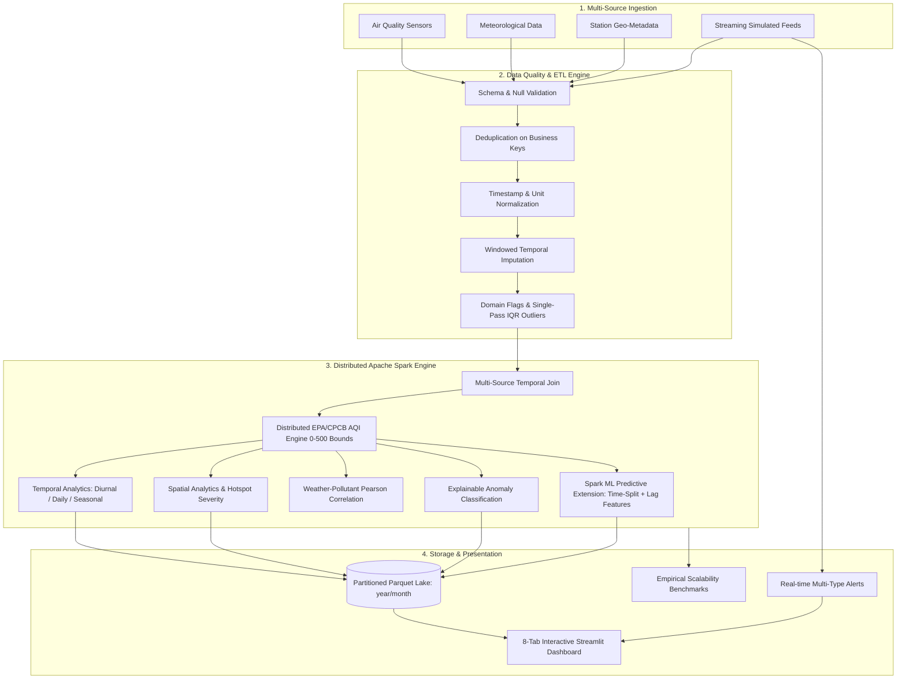

# AirSpark 🌫️⚡
### A Scalable Big Data Analytics Framework for Multi-Source Air Quality Monitoring and Spatio-Temporal AQI Analysis Using Apache Spark

[](https://www.python.org/)
[](https://spark.apache.org/)
[](https://openjdk.org/)
[](LICENSE)
[](tests/)

---

## 1. Executive Summary & Problem Statement

Atmospheric air pollution is a critical global public health concern. While existing research investigates individual aspects—such as isolated machine learning forecasting, IoT hardware sensing, distributed query processing, or data cleaning—there is a significant gap in integrated, academically sound **Big Data Analytics (BDA)** systems that unify:

1. **Heterogeneous data fusion** (combining multi-station air quality, meteorological variables, and geographical metadata).
2. **Robust data quality engineering** (handling sensor drift, missing values, duplicates, domain limits, and statistical outliers without deleting valid pollution surges).
3. **Distributed processing** (leveraging Apache Spark / PySpark 4.2.0 for high-throughput batch and stream workloads).
4. **Standard-compliant AQI calculation** (accurate piecewise linear interpolation against official US EPA and CPCB benchmarks, strictly bounded to $[0, 500]$ with explicit exceedance flags).
5. **Multi-dimensional Spatio-Temporal Analytics** (diurnal 24-hr curves, seasonal variations, station ranking, and persistent hotspot detection).
6. **Spark ML Forecasting Extension** (chronological time-aware train/test split, station lag/rolling features, Linear Regression & Random Forest models with RMSE, MAE, R², model persistence, and prediction persistence).
7. **Real-time Spark Structured Streaming** with event-time watermarking, sliding window statistics, and automated multi-type alert dispatch (unhealthy AQI, hazardous AQI, PM2.5 spike, rapid change rate).
8. **Interactive visualization** via an 8-tab Streamlit & Plotly dashboard.
9. **Empirical performance benchmarking** measuring real execution time, throughput (records/sec), and partition scalability.

**AirSpark** bridges this gap by delivering an end-to-end, production-grade Big Data Analytics platform.

---

## 2. Logical Architecture



---

## 3. Technology Stack & Verified Environment

- **Core Distributed Processing:** Apache Spark (PySpark 4.2.0), Spark SQL Catalyst Expressions, Spark Structured Streaming, Spark ML
- **Language & Runtime:** Python 3.12.10, Java OpenJDK 17.0.20.1 (Windows x64)
- **Data Formats:** Apache Parquet (Snappy-compressed columnar format), CSV, JSON
- **Visualization & UI:** Streamlit, Plotly Express, Graph Objects
- **Data Engineering & Math:** NumPy, Pandas (for small-scale support tasks), PyArrow 19.0.1, SciPy
- **Testing & Quality:** Pytest 9.1.1 (30 automated test cases, 100% passing)

---

## 4. Quick Start & Execution Guide

### Step 1: Environment Validation
Run the automated environment and PySpark diagnostic validator:
```powershell
python run.py validate
```

### Step 2: Generate Multi-Source Datasets
Generate realistic synthetic air-quality, meteorological, and station datasets:
```powershell
python run.py generate --stations 10 --days 30 --frequency 60
```

### Step 3: Execute Master Distributed Batch Pipeline
Run end-to-end Spark ETL, data quality audit, AQI calculations, spatial-temporal analytics, Spark ML forecasting, and Parquet lake persistence:
```powershell
python run.py batch --aqi-standard US_EPA
```
*Note: Supports `--aqi-standard INDIA_CPCB` and `--skip-ml` as well.*

### Step 4: Run Real-Time Streaming Demonstration
Execute Spark Structured Streaming with sliding windows and multi-type alert triggers:
```powershell
python run.py streaming --duration 10 --rate 5 --stations 5
```

### Step 5: Run Scalability & Partitioning Benchmarks
Execute real empirical benchmarks measuring execution times, throughput, and partition scalability:
```powershell
python run.py benchmark
```

### Step 6: Launch Interactive Streamlit Dashboard
Launch the web analytics dashboard:
```powershell
python run.py dashboard --port 8501
```
Open `http://localhost:8501` in your browser.

### Step 7: Run Automated Test Suite
Execute the comprehensive test suite (30 unit, integration, and end-to-end tests):
```powershell
python run.py test
```

---

## 5. Research Methodology & Defensible Claims

1. **BDA-First Architecture**: Spark is the central engine for all data quality filtering, joins, sub-index calculations, temporal profile aggregations, and spatial hotspot calculations.
2. **Standard AQI Bounds**: Standard AQI is strictly constrained to $[0, 500]$ according to EPA/CPCB regulations. Concentrations exceeding maximum standard breakpoints are flagged via `is_aqi_out_of_range=True` and `aqi_exceedance_flag=True` while retaining concentration provenance.
3. **Non-Destructive Outlier Flagging**: Statistical outliers are detected using IQR and flagged with boolean columns (`is_<pollutant>_outlier`, `is_any_outlier`) without blindly purging genuine acute pollution events.
4. **Chronological ML Evaluation**: The Spark ML forecasting experiment splits datasets strictly by time ($80\%$ historical training, $20\%$ holdout evaluation) with station-specific lag and rolling features to guarantee zero temporal data leakage.
5. **Local Cluster Scalability**: Experiments run on `local[*]` cores, demonstrating scalable parallel execution, partition load distribution, and throughput metrics across varying dataset sizes.

