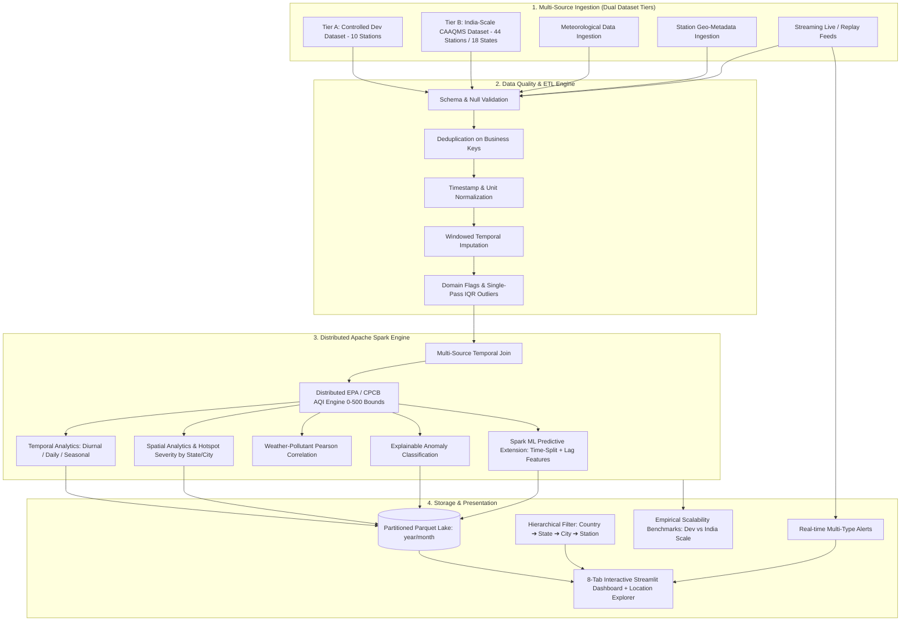

# AirSpark 🌫️⚡
### A Scalable Big Data Analytics Framework for Multi-Source Air Quality Monitoring and Spatio-Temporal AQI Analysis Using Apache Spark

[](https://www.python.org/)
[](https://spark.apache.org/)
[](https://openjdk.org/)
[](LICENSE)
[](tests/)

---

## 1. Executive Summary & Problem Statement

Atmospheric air pollution is a critical global public health concern. While existing research investigates individual aspects—such as isolated machine learning forecasting, IoT hardware sensing, distributed query processing, or data cleaning—there is a significant gap in integrated, academically sound **Big Data Analytics (BDA)** systems that unify:

1. **Heterogeneous data fusion** (combining multi-station air quality, meteorological variables, and geographical metadata).
2. **Robust data quality engineering** (handling sensor drift, missing values, duplicates, domain limits, and statistical outliers without deleting valid pollution surges).
3. **Multi-tier dataset scalability** (supporting both a controlled 10-station development dataset and an extensive **India-Scale CAAQMS Nationwide Monitoring Dataset** with 44 stations across 18 states/UTs and 31 cities).
4. **Distributed processing** (leveraging Apache Spark / PySpark 4.2.0 for high-throughput batch and stream workloads).
5. **Standard-compliant AQI calculation** (accurate piecewise linear interpolation against official US EPA and Indian CPCB benchmarks, strictly bounded to $[0, 500]$ with explicit exceedance flags).
6. **Hierarchical Location-Aware Spatio-Temporal Analytics** (dynamic exploration across Country ➔ State ➔ City ➔ Station, diurnal 24-hr curves, seasonal variations, station ranking, and persistent hotspot detection).
7. **Spark ML Forecasting Extension** (chronological time-aware train/test split, station lag/rolling features, Linear Regression & Random Forest models with RMSE, MAE, R², model persistence, and prediction persistence).
8. **Real-time Spark Structured Streaming** with event-time watermarking, sliding window statistics, and automated multi-type alert dispatch (unhealthy AQI, hazardous AQI, PM2.5 spike, rapid change rate).
9. **Interactive visualization** via an 8-tab Streamlit & Plotly MapLibre dashboard with location exploration.
10. **Empirical performance benchmarking** measuring real execution time, throughput (records/sec), and partition scalability.

**AirSpark** bridges this gap by delivering an end-to-end, production-grade Big Data Analytics platform.

---

## 2. Logical Architecture



---

## 3. Dataset Tiers & Academic Data Provenance

AirSpark incorporates a dual-tier dataset architecture designed for rigorous academic validation, reproducible benchmarking, and scalable geographic exploration:

```text
AirSpark
│
├── Tier A: Controlled Development Dataset
│   ├── Synthetic Reference Network (10 stations)
│   └── Controlled simulated observations (~7,200 records)
│
└── Tier B: India-Scale Experimental Dataset
    ├── Authentic CPCB/CAAQMS-derived station metadata (44 stations, 18 States/UTs, 31 cities)
    ├── Controlled synthetic/simulated observations (30-day hourly: ~32,155 AQ, ~31,996 weather records)
    └── Derived Big Data analytics (Calculated AQI, Hotspot Severity Index, Spark ML, Streaming Alerts)
```

| Tier | Dataset Name | Geographic Scope | Representative Stations | Temporal Scope & Volume | Provenance Classification |
|---|---|---|---|---|---|
| **Tier A** | **Controlled Development Dataset** | 10 Major Metropolitan Reference Points | 10 Stations | 30 Days (Hourly: ~7,200 records) | Fully synthetic reference baseline for unit testing, CI/CD, and pipeline verification |
| **Tier B** | **India-Scale Experimental Dataset** | 18 States / UTs, 31 Cities Across India | 44 Stations (Representative Subset) | 30 Days (Hourly: 32,155 AQ / 31,996 Weather) | Authentic CPCB/CAAQMS metadata + Controlled synthetic observations + Derived Spark analytics |

### 3.1 Rigorous Three-Tier Provenance Classification

1. **Authentic Source-Derived Metadata (Real-World CAAQMS Registries):**
   - **Fields:** `station_id`, `station_name`, `state`, `city`, `latitude`, `longitude`, `elevation`, `station_type`.
   - **Authorities:** Central Pollution Control Board (CPCB), State Pollution Control Boards (SPCBs), Ministry of Environment, Forest and Climate Change (MoEFCC), and National Air Quality Index (NAQI) Portal.
   - **Scope:** 44 representative monitoring stations across 18 States/UTs and 31 cities (an experimental subset, not the complete national network). Coordinate reference system: WGS84 (EPSG:4326).

2. **Controlled Synthetic / Simulated Observations (Physics-Informed Simulation):**
   - **Pollutant Observations:** PM2.5, PM10, NO2, SO2, CO, O3.
   - **Meteorological Observations:** Temperature, Relative Humidity, Wind Speed, Wind Direction, Barometric Pressure, Rainfall.
   - **Methodology:** Physics-informed numerical modeling incorporating regional baseline pollution levels, diurnal planetary boundary layer inversion, photochemical ozone kinetics, wind dispersion, and coupled weather correlations.
   - **Data Quality Artifacts:** Controlled sensor quality anomalies (missing values ~2.8%, duplicates ~1.5%, sensor domain violations <0.5%) injected to empirically evaluate AirSpark's data quality cleaning and windowed imputation engine.

3. **Derived Analytics (AirSpark Distributed Computing Engine):**
   - **Calculations:** Piecewise Linear Calculated AQI (CPCB & EPA standards, bounded $[0, 500]$), Research Extrapolated AQI, Pollutant Sub-indices, Dominant Pollutant Detection, Hotspot Severity Index (HSI), Temporal Diurnal Profiles, Hierarchical Spatial Aggregations, Spark ML Regressors, Real-Time Streaming Alerts, and Scalability Benchmark Metrics.

> **Plug-and-Play Architectural Capability:** The AirSpark ingestion, validation, and distributed processing pipeline is designed with exact regulatory schemas matching public CPCB CAAQMS continuous monitoring data dumps. Simulated observation CSVs can be replaced with real public monitoring observation archives without altering the analytical pipeline or downstream Spark jobs.

---

## 4. Technology Stack & Verified Environment

- **Core Distributed Processing:** Apache Spark (PySpark 4.2.0), Spark SQL Catalyst Expressions, Spark Structured Streaming, Spark ML
- **Language & Runtime:** Python 3.12.10, Java OpenJDK 17.0.20.1 (Windows x64)
- **Data Formats:** Apache Parquet (Snappy-compressed columnar format), CSV, JSON
- **Visualization & UI:** Streamlit 1.64+, Plotly Express, Plotly MapLibre (Dark Matter Style)
- **Data Engineering & Math:** NumPy, Pandas, PyArrow 25.0+, SciPy
- **Testing & Quality:** Pytest 9.1.1 (40 automated test cases, 100% passing)

---

## 5. Quick Start & Execution Guide

### Step 1: Environment Validation
Run the automated environment and PySpark diagnostic validator:
```powershell
python run.py validate
```

### Step 2: Generate Datasets
Generate either the Controlled Development or India-Scale CAAQMS dataset:
```powershell
# Controlled Development Dataset (10 stations):
python run.py generate --dataset dev --stations 10 --days 30

# India-Scale CAAQMS Dataset (44 stations across 18 states):
python run.py generate --dataset india --days 30
```

### Step 3: Execute Master Distributed Batch Pipeline
Run end-to-end Spark ETL, data quality audit, AQI calculations, spatial-temporal analytics, Spark ML forecasting, and Parquet lake persistence:
```powershell
# Run Batch Pipeline for Controlled Dev Dataset:
python run.py batch --dataset dev --aqi-standard US_EPA

# Run Batch Pipeline for India-Scale Dataset (CPCB Standard):
python run.py batch --dataset india --aqi-standard INDIA_CPCB
```

### Step 4: Run Real-Time Streaming Demonstration
Execute Spark Structured Streaming with sliding windows and multi-type alert triggers:
```powershell
python run.py streaming --duration 10 --rate 5 --stations 5
```

### Step 5: Run Scalability & Partitioning Benchmarks
Execute real empirical benchmarks measuring execution times, throughput, and partition scalability:
```powershell
python run.py benchmark
```

### Step 6: Launch Interactive Streamlit Dashboard with Location Explorer
Launch the web analytics dashboard:
```powershell
python run.py dashboard --port 8501
```
Open `http://localhost:8501` in your browser.

Use the sidebar **Location Explorer** to seamlessly navigate across:
`All India ➔ State (e.g. Maharashtra) ➔ City (e.g. Mumbai) ➔ Station (e.g. Bandra Kurla Complex Station)`

### Step 7: Run Automated Test Suite
Execute the comprehensive test suite (40 unit, integration, and end-to-end tests):
```powershell
python run.py test
```

---

## 6. Research Methodology & Defensible Claims

1. **BDA-First Architecture**: Spark is the central engine for all data quality filtering, joins, sub-index calculations, temporal profile aggregations, and spatial hotspot calculations across both dataset tiers.
2. **Standard AQI Bounds**: Standard AQI is strictly constrained to $[0, 500]$ according to EPA/CPCB regulations. Concentrations exceeding maximum standard breakpoints are flagged via `is_aqi_out_of_range=True` and `aqi_exceedance_flag=True` while retaining concentration provenance.
3. **Non-Destructive Outlier Flagging**: Statistical outliers are detected using IQR and flagged with boolean columns (`is_<pollutant>_outlier`, `is_any_outlier`) without blindly purging genuine acute pollution events.
4. **Location-Aware Temporal Aggregations**: Temporal curves (daily progression, 24-hr diurnal cycle, pollutant concentrations) are computed dynamically for the chosen geographic scope.
5. **Chronological ML Evaluation**: The Spark ML forecasting experiment splits datasets strictly by time ($80\%$ historical training, $20\%$ holdout evaluation) with station-specific lag and rolling features to guarantee zero temporal data leakage.
6. **Local Mode Scalability**: Experiments run on `local[*]` cores, demonstrating scalable parallel execution, partition load distribution, and throughput metrics across varying dataset sizes.
