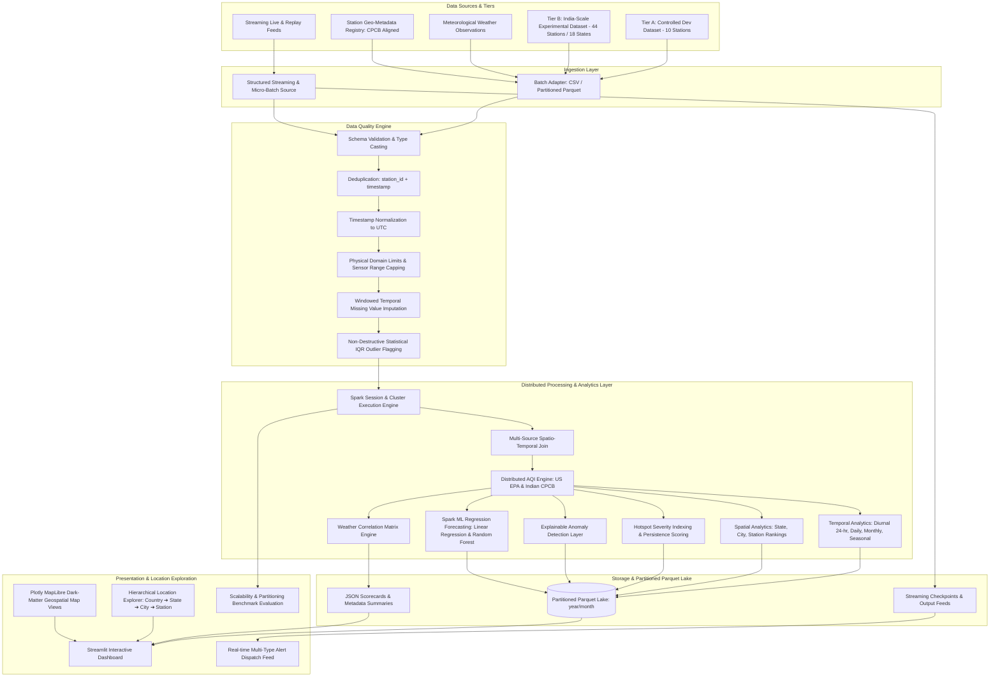

# AirSpark Architectural Blueprint

AirSpark is an integrated Big Data Analytics (BDA) framework designed to ingest, clean, integrate, compute, analyze, and visualize high-velocity, multi-source spatio-temporal air quality and meteorological data using Apache Spark and PySpark.

---

## 1. System Architecture Overview

---

## 2. Core Architectural Components

### 2.1 Multi-Tier Ingestion Layer
- **Tier A (Controlled Development Dataset):** 10-station reference dataset used for rapid local development, unit/integration testing, and CI/CD validation.
- **Tier B (India-Scale Experimental Dataset):** Nationwide monitoring dataset comprising 44 representative stations across 18 states/UTs and 31 cities, using authentic Central Pollution Control Board (CPCB) monitoring station metadata with controlled synthetic pollutant and meteorological observations.
- **Plug-and-Play Ingestion Design:** Built with exact regulatory schemas matching official CPCB CAAQMS formats, allowing seamless drop-in of real monitoring observation files without redesigning the analytics pipeline.
- **Batch Ingestion Engine:** Dynamically ingests multi-source data with explicit `StructType` schemas to avoid runtime schema inference overhead.
- **Streaming Ingestion Source:** Structured Streaming and verified micro-batch replay with event-time watermarking.

### 2.2 Data Quality & ETL Pipeline
- **Validation:** Enforces mandatory primary keys (`station_id`, `timestamp`) and numeric bounds.
- **Deduplication:** Eliminates duplicate observations based on business composite keys (`station_id`, `timestamp`).
- **Normalization:** Standardizes timestamps into UTC Spark `TimestampType`.
- **Imputation:** Two-stage windowed temporal forward-fill followed by station-level and global median fallbacks.
- **Outlier Flagging:** Employs non-destructive statistical IQR and Z-Score flagging, ensuring legitimate extreme pollution events are preserved for scientific analysis.

### 2.3 Distributed AQI Calculation Engine
- Evaluates individual pollutant sub-indices for $PM_{2.5}, PM_{10}, NO_2, SO_2, CO, O_3$ using piecewise linear interpolation against official standards (US EPA and Indian CPCB).
- Computes overall AQI as the upper supremum ($AQI = \max(I_p)$) and identifies the instantaneous dominant pollutant.
- Standard AQI is strictly constrained to $[0, 500]$ according to EPA/CPCB regulations. Concentrations exceeding maximum standard breakpoints are flagged via `is_aqi_out_of_range=True` and `aqi_exceedance_flag=True` while retaining concentration provenance.

### 2.4 Spatio-Temporal Analytics & Location Filtering
- **Hierarchical Location Explorer:** Clean filtering architecture supporting `All India ➔ State ➔ City ➔ Station` navigation.
- **Temporal Analytics:** Diurnal 24-hour cycle aggregation, daily summary statistics, seasonal variation analysis, and rolling-window moving averages.
- **Spatial Analytics:** State, city, and station aggregations and **Hotspot Severity Scoring** based on persistent exposure duration and peak pollution loads.
- **Correlations:** Spark DataFrame Pearson correlation matrix between meteorological conditions and atmospheric pollutants.
- **Explainable Anomalies:** Evaluates temporal jump ratios and multi-pollutant cross-correlations to classify anomalies into sensor malfunctions vs acute atmospheric pollution surges.

### 2.5 Storage & Partitioning Strategy
- Writes processed datasets to Apache Parquet with Snappy compression.
- Partitions large-scale time series datasets hierarchically by `year` and `month` to optimize query pruning during spatial-temporal slicing.
