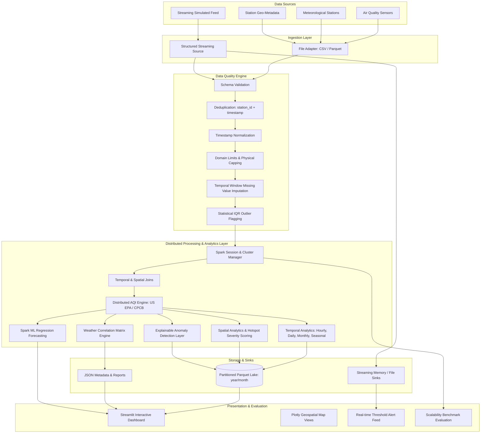

# AirSpark Architectural Blueprint

AirSpark is an integrated Big Data Analytics (BDA) framework designed to ingest, clean, integrate, compute, analyze, and visualize high-velocity, multi-source spatio-temporal air quality and meteorological data using Apache Spark and PySpark.

---

## 1. System Architecture Overview

---

## 2. Core Architectural Components

### 2.1 Ingestion Layer
- **Batch Ingestion Engine**: Dynamically ingests raw CSV and Parquet files into Spark DataFrames with explicit `StructType` schemas to avoid runtime schema inference overhead.
- **Structured Streaming Source**: Utilizes Spark's `readStream` micro-batch mechanism to monitor incoming sensor data with configurable trigger frequencies.

### 2.2 Data Quality & ETL Pipeline
- **Validation**: Enforces mandatory primary keys (`station_id`, `timestamp`) and numeric bounds.
- **Deduplication**: Eliminates duplicate observations based on business keys.
- **Normalization**: Handles diverse timestamp formats (ISO-8601, RFC-3339, standard SQL) into UTC Spark `TimestampType`.
- **Imputation**: Two-stage windowed temporal forward-fill followed by station-level and global median fallbacks.
- **Outlier Flagging**: Employs non-destructive statistical IQR and Z-Score flagging, ensuring legitimate extreme pollution events are preserved for scientific analysis.

### 2.3 Distributed AQI Calculation Engine
- Evaluates individual pollutant sub-indices for $PM_{2.5}, PM_{10}, NO_2, SO_2, CO, O_3$ using piecewise linear interpolation against official standards (US EPA and Indian CPCB).
- Computes overall AQI as the upper supremum ($AQI = \max(I_p)$) and identifies the instantaneous dominant pollutant.

### 2.4 Spatio-Temporal Analytics Layer
- **Temporal**: Diurnal 24-hour cycle aggregation, daily summary statistics, seasonal variation analysis, and rolling-window moving averages.
- **Spatial**: Station ranking, geographic aggregation, and **Hotspot Severity Scoring** based on persistent exposure duration and peak pollution loads.
- **Correlations**: Spark DataFrame Pearson correlation matrix between meteorological conditions and atmospheric pollutants.
- **Explainable Anomalies**: Evaluates temporal jump ratios and multi-pollutant cross-correlations to classify anomalies into sensor malfunctions vs acute atmospheric pollution surges.

### 2.5 Storage & Partitioning Strategy
- Writes processed datasets to Apache Parquet with Snappy compression.
- Partitions large-scale time series datasets hierarchically by `year` and `month` to optimize query pruning during spatial-temporal slicing.
